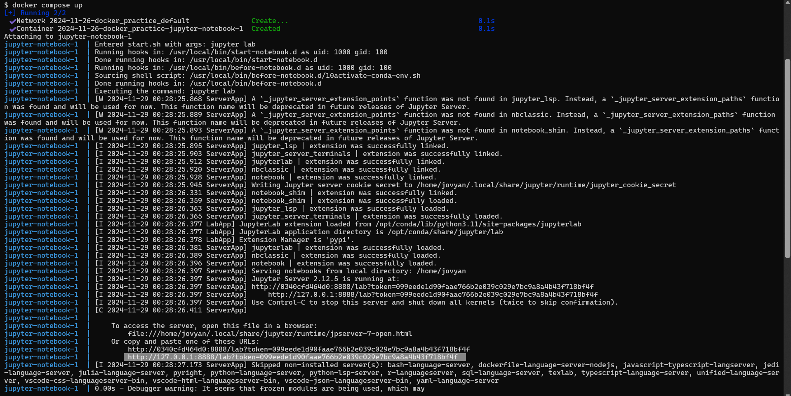

# Age Group Predictor

  - author: Dongchun Chen, Ismail (Husain) Bhinderwala, Rashid Mammadov & Sienko Ikhabi

A data analysis project for DSCI 522 (Data Science workflows); a
course in the Master of Data Science program at the University of
British Columbia.

## Project Summary

Here we attempt to build a classification model using the Logistic Regression
algorithm which can predict whether an individual belongs to the senior (≥65 years) age group or 
the non-senior (<65 years) age group based on specific features. The model utilizes a supervised machine 
learning algorithm to identify patterns and relationships within the dataset to make accurate predictions.

The dataset used in this project is a subset of the National Health and Nutrition Examination Survey (NHANES) 2013-2014, 
created by the Centers for Disease Control and Prevention (CDC). The subset was donated on September 21, 2023, 
and is designed for predicting respondents' age. The dataset can be found 
[here](https://archive.ics.uci.edu/dataset/887/national+health+and+nutrition+health+survey+2013-2014+(nhanes)+age+prediction+subset).
The NHANES dataset collects extensive health and nutritional information from a diverse U.S. population, and this 
particular subset narrows the focus to selected features hypothesized to correlate strongly with age.

## Report
The final report can be found [here](https://ubc-mds.github.io/DSCI522-2425-group31_age-group-prediction/reports/age_prediction_report.html).

## Dependencies

- [Docker](https://www.docker.com/) 
- [VS Code](https://code.visualstudio.com/download)
- [VS Code Jupyter Extension](https://marketplace.visualstudio.com/items?itemName=ms-toolsai.jupyter)

## Usage

### Setup

> If you are using Windows or Mac, make sure Docker Desktop is running.

1. Clone this GitHub repository by pasting the following command in the terminal:

```
git clone https://github.com/UBC-MDS/DSCI522-2425-group31_age-group-prediction.git
```

### Running the analysis

1. Navigate to the root of this project on your computer using the
   command line and enter the following command:

``` 
docker compose up
```

2. In the terminal, look for a URL that starts with 
`http://127.0.0.1:8888/lab?token=` 
(for an example, see the highlighted text in the terminal below). 
Copy and paste that URL into your browser.



3. Once the Jupyter Lab is running in your browser, open a terminal within the Jupyter Lab 
and execute the following command to reset the project to a clean state (i.e., remove all 
files generated by previous runs of the analysis):

```
make clean
```

4. To run the analysis in its entirety, 
enter the following command in the terminal:

```
make all
```

5. To view the analysis report navigate to [`reports`](reports) directory in the root folder 
and then select `age_prediction_report.pdf`.

### Clean up

1. To shut down the container and clean up the resources, 
type `Cntrl` + `C` in the terminal
where you launched the container, and then type `docker compose rm`

## Developer notes

### Developer dependencies
- `conda` (version 23.9.0 or higher)
- `conda-lock` (version 2.5.7 or higher)

### Adding a new dependency

1. Add the dependency to the `environment.yml` file on a new branch.

2. Run `conda-lock -k explicit --file environment.yml -p linux-64` to update the `conda-linux-64.lock` file.

2. Re-build the Docker image locally to ensure it builds and runs properly.

3. Push the changes to GitHub. A new Docker
   image will be built and pushed to Docker Hub automatically.
   It will be tagged with the SHA for the commit that changed the file.

4. Update the `docker-compose.yml` file on your branch to use the new
   container image (make sure to update the tag specifically).

5. Send a pull request to merge the changes into the `main` branch. 

### Running the test suite

Use the same `docker compose up` command as described in the [Running the analysis](#running-the-analysis) section above
to launch Jupyter lab.
Tests are run using the `pytest` command in the root of the project.
More details about the test suite can be found in the 
[`test`](test) directory.
## License

The analysis report contained herein are licensed under the
[Attribution-NonCommercial-ShareAlike 4.0 International (CC BY-NC-SA 4.0) License](https://creativecommons.org/licenses/by-nc-sa/4.0/).
See [the license file](LICENSE.md) for more information. If
re-using/re-mixing please provide attribution and link to this webpage.
The software code contained within this repository is licensed under the
MIT license. See [the license file](LICENSE.md) for more information.
